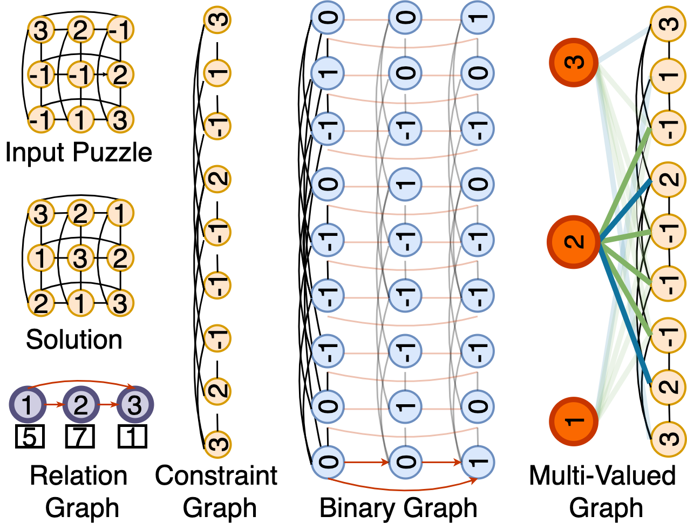

# output-space-invariance
Training and data generation codes for [Neural Models for Output-Space Invariance in Combinatorial Problems](https://openreview.net/forum?id=ibrUkC-pbis).

Our training code has been adapted from [google/neural-logic-machines](https://github.com/google/neural-logic-machines) and uses [Jacinle python toolbox](https://github.com/vacancy/Jacinle).

For generating the data for sudoku, we use [GSS](https://github.com/bartp5/gss) to verify if the puzzle has a unique solution or not.

<p align="center">
  
  <br>
    <em>Message Passing Graphs for our two models: Binarized Model and Multi-valued Model </em>
</p>

## Installation

Clone this repository:

```
git clone https://github.com/dair-iitd/output-space-invariance --recursive
```

Install [Jacinle](https://github.com/vacancy/Jacinle) included in `third_party/Jacinle`. You need to add the bin path to your global `PATH` environment variable:

```
export PATH=<path_to_output-space-invariance>/third_party/Jacinle/bin:$PATH
```

Create a conda environment for output-space-invariance:

```
conda env create -f environment.yml
```


## Data Generation with Sample commands
This repo contains three tasks over which we experiment - GCP, Futoshiki and Sudoku. 
Download the datasets from this [drive link](https://drive.google.com/drive/folders/1v9oUJdAxNczs-cbaa4ZruRrVBGnY73uS?usp=sharing).
Put them in a folder named `data` at the same level as the folder `trainer`

Sample commands for dataset generation

* GCP

```
python datagen/gcp_gen/gen.py --chromatic-num 5 --num-puzzles 300 --mask-low 60 --mask-high 70 --nodes-low 90 --nodes-high 120  --num-cores 5 --save-path data/gcp-puzzles.pkl
```

* Sudoku

```
python datagen/sudoku_gen/gen.py --board-size 8 --num-puzzles 50 --mask-low 19 --mask-high 43 --unq-flag 1 --num-cores 5 --save-path data/sudoku-puzzles.pkl
```

* Futoshiki

```
python datagen/futo_gen/gen.py --board-size 8 --num-puzzles 50 --mask-low 30 --mask-high 70 --save-path data/futoshiki-puzzles.pkl
```


## Training and evaluating models

* GCP

```
# Binarized Model
jac-run trainer/train.py --use-gpu --save-interval 5 --test-interval 1 --num-workers 3 --binary-model 1 --task gcp --model gcp --batch-size 16 --test-batch-size 4 --epoch-size 800 --incomplete-targetset 1 --min-loss 1   --attention-edges inter_diff intra_diff --seed 12 --epochs 50 --hidden-dim 96 --layer-norm 1 --lr 0.0001 --share-all-msg-passing-mlp 0 --edge-embeddings-dim 0  --dump-dir trained_models/code_testing/gcp/bin --train-file data/gcp_train_k-4_n-40to100_mask-30to70.pkl --test-file data/gcp_val_k-4_n-40to100_mask-30to70.pkl

# Multi-valued Model
jac-run trainer/train.py --task gcp  --use-gpu --save-interval 1 --test-interval 10  --model gcp --batch-size 64 --test-batch-size 128 --epoch-size 400 --num-workers 3  --output-embedding-generator linear --diff-edges-in-class-graph 1 --class-rrn-num-steps 1 --share-mp-wts-in-gen 1 --seed 12 --epochs 200 --train-data-size 25010 --max-num-embeddings 7 --embedding-ortho-loss-factor 0.01 --incomplete-targetset 1 --min-loss 1 --attention-edges diff --dump-dir trained_models/code_testing/gcp/mv --train-file data/gcp_train_k-4_n-40to100_mask-30to70.pkl --test-file data/gcp_val_k-4_n-40to100_mask-30to70.pkl
```

* Sudoku

```
# Binarized Model
jac-run trainer/train.py --use-gpu --save-interval 10 --test-interval 1 --test-batch-size 4 --num-workers 3 --binary-model 1 --task sudoku --model gcp --batch-size 4 --epoch-size 2500 --incomplete-targetset 0 --min-loss 0  --attention-edges inter_diff intra_diff --seed 2011 --epochs 50 --hidden-dim 96 --layer-norm 1 --lr 1e-03 --dump-dir trained_models/code_testing/sudoku/bin --train-file data/sudoku_9_train_e_unq_10k.pkl --test-file data/sudoku_9_val_e_big_unique.pkl

# Multi-valued Model
jac-run trainer/train.py --task sudoku --use-gpu --save-interval 30 --test-interval 1  --model gcp --batch-size 28 --test-batch-size 28 --epoch-size 360 --num-workers 3 --output-embedding-generator linear  --diff-edges-in-class-graph 1 --class-rrn-num-steps 1 --share-mp-wts-in-gen 1 --attention-edges diff --seed 12 --epochs 350 --train-data-size 10000 --max-num-embeddings 16 --embedding-ortho-loss-factor 0.01 --incomplete-targetset 0 --min-loss 0 --dump-dir trained_models/code_testing/sudoku/mv/ --train-file data/sudoku_9_train_e_unq_10k.pkl --test-file data/sudoku_9_val_e_big_unique.pkl
```

* Futoshiki

```
# Binarized Model
jac-run trainer/train.py --use-gpu --save-interval 5 --test-interval 1 --test-batch-size 4 --num-workers 3 --binary-model 1 --task futoshiki --model futo --batch-size 16 --epoch-size 750 --incomplete-targetset 0 --min-loss 0 --share-lt-edges 1 --seed 2011 --epochs 50 --hidden-dim 96 --layer-norm 1 --dump-dir trained_models/code_testing/futo/bin --train-file data/futo_unq_train_bs-6_mask-30to70.pkl --test-file data/futo_unq_val_bs-6_mask-30to70.pkl

# Multi-valued Model
jac-run trainer/train.py --task futoshiki  --use-gpu --save-interval 30 --test-interval 1  --model futo --batch-size 64 --test-batch-size 64 --epoch-size 200 --num-workers 3  --output-embedding-generator linear  --diff-edges-in-class-graph 1 --class-rrn-num-steps 1 --share-mp-wts-in-gen 1 --seed 12 --epochs 200 --train-data-size 12300 --max-num-embeddings 12 --embedding-ortho-loss-factor 0.01  --attention-edges diff --dump-dir trained_models/code_testing/futo/mv --train-file data/futo_unq_train_bs-6_mask-30to70.pkl --test-file data/futo_unq_val_bs-6_mask-30to70.pkl
```

To evaluate the model on test file give test file path instead of validation file and add flag `--test-only`.

Check out further command line arguments and their description by running

```
jac-run trainer/train.py --help
```

